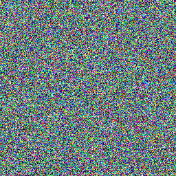
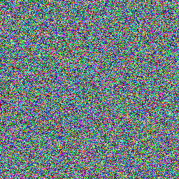
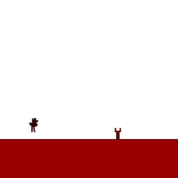

# rustedbytes-bytepusher-rombuilder

BytePusher VM ROM Builder

## Catwalk Video ROM

## Evy Image ROM

## Random Image ROM

## Lenna Image ROM

## Animated Random Noise ROM

This ROM demonstrates animated random noise patterns. The screen updates continuously with pseudo-random patterns across 4 different frames. The animation loops at approximately 3.75 FPS (4 sync operations per frame).

## T-Runner ROM

This ROM demonstrates the T-Runner game concept, inspired by Chrome's dinosaur game. The animation shows a running character with obstacles moving from right to left. This is an animated demo with 8 frames showing the scrolling gameplay concept.
